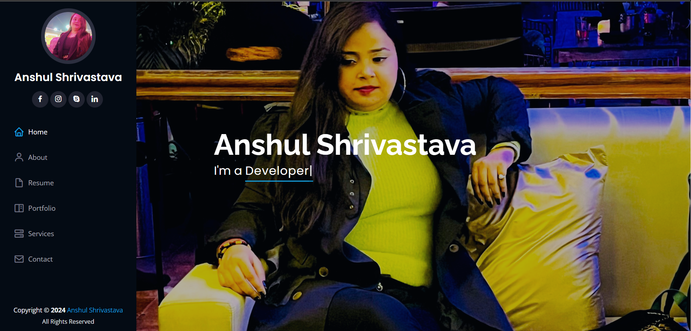

- 👨‍💻 All about me is at [My Website](https://anshulshriv.netlify.app/)

- 📫 How to reach me **anshul.programmingjobs@gmail.com**

<h3 align="left">Connect with me:</h3>

<h3 align="left">Languages and Tools:</h3>
 
          

